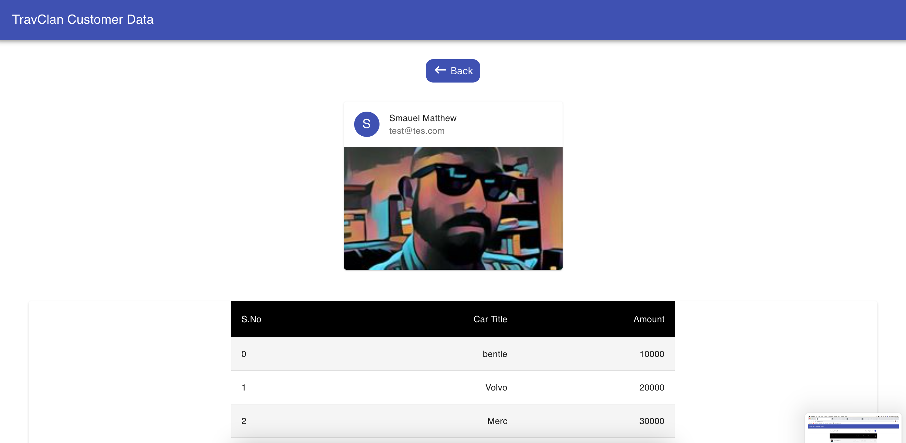

# TravClan Assignment Customer Data 

# How to setup the Project on local System?

    1.First you need to download this repo or Clone the repo.
    2.Then open in the editor.
    3.Install Node js in your system if not installed.
    4.run the command for installing the modules.
     >>npm install
    5.run the project by commmand
    >> npm start

## Home Page

## Sort Customer By BID Amount

## Show Min/Max Bid

## Show Single User Profile

## Last Page

